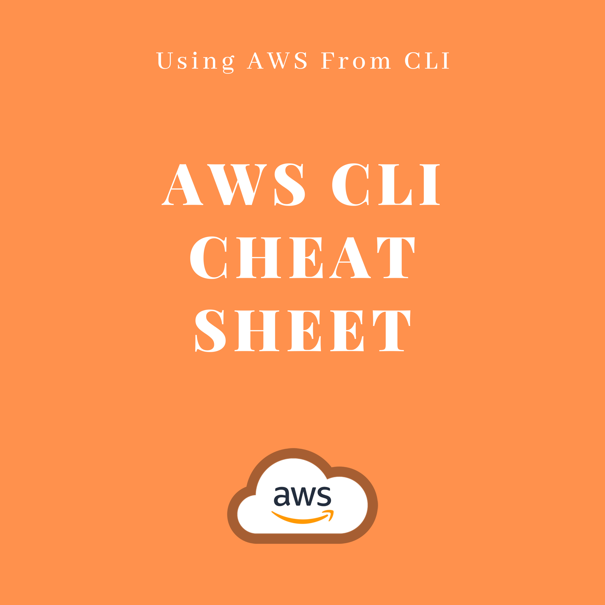

# AWS CLI Cheat Sheet

------



# Table of Contents

   * [Volumes](#volumes)
      * [Describing volumes](#describing-volumes)
      * [Describing volumes using a different aws user profile](#describing-volumes-using-a-different-aws-user-profile)
      * [Listing Available Volumes IDs](#listing-available-volumes-ids)
      * [Deleting a Volume](#deleting-a-volume)
      * [Deleting Unused Volumes.. Think Before You Type :-)](#deleting-unused-volumes-think-before-you-type--)
      * [Creating a Snapshot](#creating-a-snapshot)
      * [Creating an Image (AMI)](#creating-an-image-ami)
      * [Creating AMI Without Rebooting the Machine](#creating-ami-without-rebooting-the-machine)
   * [AMIs](#amis)
      * [Listing AMI(s)](#listing-amis)
      * [Describing AMI(s)](#describing-amis)
      * [Listing Amazon AMIs](#listing-amazon-amis)
      * [Using Filters](#using-filters)
   * [Lambda](#lambda)
      * [List Functions](#list-functions)
      * [Describe a Function](#describe-a-function)
      * [Invoke a Function](#invoke-a-function)
      * [Update a Function Code](#update-a-function-code)
      * [Publish a Version](#publish-a-version)
      * [List Layers](#list-layers)
      * [List Aliases of a Function](#list-aliases-of-a-function)
      * [Describe an Alias](#describe-an-alias)
      * [Create an Alias](#create-an-alias)
      * [Delete an Alias](#delete-an-alias)
      * [List Function Tags](#list-function-tags)
      * [Delete a Function](#delete-a-function)
      * [Using AWS Lambda with Scheduled Events](#using-aws-lambda-with-scheduled-events)
   * [IAM](#iam)
      * [List Users](#list-users)
      * [List Policies](#list-policies)
      * [List Groups](#list-groups)
      * [Get Users in a  Group](#get-users-in-a--group)
      * [Describing a Policy](#describing-a-policy)
      * [List Access Keys](#list-access-keys)
      * [List Keys](#list-keys)
      * [List the Access Key IDs for an IAM User](#list-the-access-key-ids-for-an-iam-user)
      * [List the SSH Public Keys for a User](#list-the-ssh-public-keys-for-a-user)
   * [S3 API](#s3-api)
      * [Listing Buckets](#listing-buckets)
      * [Listing Only Bucket Names](#listing-only-bucket-names)
      * [Getting a Bucket Region](#getting-a-bucket-region)
      * [Listing the Content of a Bucket](#listing-the-content-of-a-bucket)
      * [Syncing a Local Folder with a Bucket](#syncing-a-local-folder-with-a-bucket)
      * [Copying Files](#copying-files)
      * [Copying Folders](#copying-folders)
      * [Removing a File from a Bucket](#removing-a-file-from-a-bucket)
      * [Deleting a Bucket](#deleting-a-bucket)
      * [Emptying a Bucket](#emptying-a-bucket)
   * [VPC](#vpc)
      * [Creating A VPC](#creating-a-vpc)
      * [Allowing DNS hostnames](#allowing-dns-hostnames)
   * [Subnets](#subnets)
      * [Creating A Subnet](#creating-a-subnet)
      * [Auto Assigning Public IPs To Instances In A Public Subnet](#auto-assigning-public-ips-to-instances-in-a-public-subnet)
   * [Internet Gateway](#internet-gateway)
      * [Creating An IGW](#creating-an-igw)
      * [Attaching An IGW to A VPC](#attaching-an-igw-to-a-vpc)
   * [NAT](#nat)
      * [Setting Up A NAT Gateway](#setting-up-a-nat-gateway)
   * [Route Tables](#route-tables)
      * [Creating A Public Route Table](#creating-a-public-route-table)
      * [Creating A Private Route Tables](#creating-a-private-route-tables)
   * [CloudFront](#cloudfront)
      * [Listing Distributions](#listing-distributions)
      * [Invalidating Files From a Distribution](#invalidating-files-from-a-distribution)
      * [Sync a Local Folder with a CLoudFront Distribution](#sync-a-local-folder-with-a-cloudfront-distribution)
      * [Sync and Invalidate at the Same Time:](#sync-and-invalidate-at-the-same-time)
   * [RDS](#rds)
      * [List Databases](#list-databases)
      * [List Public Databases](#list-public-databases)
      * [List Non Protected Databases (DeletionProtection)](#list-non-protected-databases-deletionprotection)
      * [Describe the Automated Backups for a DB Instance](#describe-the-automated-backups-for-a-db-instance)
      * [Create a DB Cluster](#create-a-db-cluster)
      * [Create a DB Instance](#create-a-db-instance)
      * [Create a DB Security Group](#create-a-db-security-group)
      * [Create a Read Replica](#create-a-read-replica)
      * [Create a Custom DB Cluster Endpoint](#create-a-custom-db-cluster-endpoint)
      * [Apply Tag to a DB](#apply-tag-to-a-db)
      * [Create a Cluster Snapshot](#create-a-cluster-snapshot)
      * [Create a CloudWatch Alarm for a DB Instance](#create-a-cloudwatch-alarm-for-a-db-instance)
   * [Connect Deeper](#connect-deeper)


# Volumes


## Describing volumes

```
aws ec2 describe-volumes
```

Describing filtered volumes:

```
aws ec2 describe-volumes --filters  Name=status,Values=creating | available | in-use | deleting | deleted | error
```


e.g, describing all deleted volumes:

```
aws ec2 describe-volumes --filters  Name=status,Values=deleted
```

Filters can be applied to the attachment status:

```
aws ec2 describe-volumes --filters  Name=attachment.status,Values=attaching | attached | detaching | detached
```

e.g: describing all volumes with the status "attaching":


```
aws ec2 describe-volumes --filters  Name=attachment.status,Values=attaching
```


This is the generic form. Use --profile ```<your_profile_name> ```, if you have multiple AWS profiles or accounts.


```
aws ec2 describe-volumes --filters Name:'tag:Name',Values: ['some_values'] --profile <your_profile_name>
```


## Describing volumes using a different aws user profile

```
aws ec2 describe-volumes --filters  Name=status,Values=in-use  --profile <your_profile_name>
```


## Listing Available Volumes IDs


```
aws ec2 describe-volumes --filters  Name=status,Values=available |grep VolumeId|awk '{print $2}' | tr '\n|,|"' ' '
```

With "profile":

```
aws ec2 describe-volumes --filters  Name=status,Values=available  --profile <your_profile_name>|grep VolumeId|awk '{print $2}' | tr '\n|,|"' ' '
```


## Deleting a Volume

```
aws ec2 delete-volume --region <region> --volume-id <volume_id>
```


## Deleting Unused Volumes.. Think Before You Type :-)


```
for x in $(aws ec2 describe-volumes --filters  Name=status,Values=available  --profile <your_profile_name>|grep VolumeId|awk '{print $2}' | tr ',|"' ' '); do aws ec2 delete-volume --region <region> --volume-id $x; done
```

With "profile":

```
for x in $(aws ec2 describe-volumes --filters  Name=status,Values=available  --profile <your_profile_name>|grep VolumeId|awk '{print $2}' | tr ',|"' ' '); do aws ec2 delete-volume --region <region> --volume-id $x --profile <your_profile_name>; done
```


## Creating a Snapshot

```
aws ec2 create-snapshot --volume-id <vol-id>
```

```
aws ec2 create-snapshot --volume-id <vol-id> --description "snapshot-$(date +'%Y-%m-%d_%H-%M-%S')"
```


## Creating an Image (AMI)

```
aws ec2 create-image --instance-id <instance_id> --name "image-$(date +'%Y-%m-%d_%H-%M-%S')" --description "image-$(date +'%Y-%m-%d_%H-%M-%S')"
```


## Creating AMI Without Rebooting the Machine

```
aws ec2 create-image --instance-id <instance_id> --name "image-$(date +'%Y-%m-%d_%H-%M-%S')" --description "image-$(date +'%Y-%m-%d_%H-%M-%S')" --no-reboot
```

You are free to change the AMI name ``` image-$(date +'%Y-%m-%d_%H-%M-%S') ``` to a name of your choice.


# AMIs


## Listing AMI(s)

```
aws ec2 describe-images
```


## Describing AMI(s)

```
aws ec2 describe-images --image-ids <image_id> --profile <profile> --region <region>
```

e.g: 

```
aws ec2 describe-images --image-ids ami-e24dfa9f --profile terraform --region eu-west-3
```


## Listing Amazon AMIs

```
aws ec2 describe-images --owners amazon 
```


## Using Filters

e.g: Describing Windows AMIs that are backed by Amazon EBS.

```
aws ec2 describe-images --filters "Name=platform,Values=windows" "Name=root-device-type,Values=ebs"
```

e.g: Describing Ubuntu AMIs 

```
aws ec2 describe-images --filters "Name=name,Values=ubuntu*"
```

# Lambda


## List Functions

```
aws lambda list-functions
```


## Describe a Function

```
aws lambda get-function --function-name  my-function
```


## Invoke a Function

```
aws lambda invoke --function-name my-function --payload '{ "name": "Bob" }' response.json
```


## Update a Function Code

````
aws lambda update-function-code --function-name  my-function --zip-file fileb://my-function.zip
````


## Publish a Version

```
aws lambda publish-version --function-name my-function
```


## List Layers

Let's take this example in which we want to list information of layers that are compatible with Python 3.7 runtime. 

```
aws lambda list-layers --compatible-runtime python3.7
```

Possible layers runtime:

```
nodejs
nodejs4.3
nodejs6.10
nodejs8.10
nodejs10.x
nodejs12.x
java8
java8.al2
java11
python2.7
python3.6
python3.7
python3.8
dotnetcore1.0
dotnetcore2.0
dotnetcore2.1
dotnetcore3.1
nodejs4.3-edge
go1.x
ruby2.5
ruby2.7
provided
provided.al2
```


## List Aliases of a Function

```
aws lambda list-aliases --function-name my-function
```


## Describe an Alias

```
aws lambda get-alias --function-name my-function --name LIVE
```


## Create an Alias

```
aws lambda create-alias --function-name my-function --description "alias description goes here" --function-version 1 --name LIVE
```


## Delete an Alias

```
aws lambda delete-alias --function-name my-function --name LIVE
```


## List Function Tags

```
aws lambda list-tags --resource arn:aws:lambda:eu-west-1:xxxxxxxxxxx:function:my-function
```


## Delete a Function

````
aws lambda delete-function --function-name my-function
````


## Using AWS Lambda with Scheduled Events

```
sid=Sid$(date +%Y%m%d%H%M%S); aws lambda add-permission --statement-id $sid --action 'lambda:InvokeFunction' --principal events.amazonaws.com --source-arn arn:aws:events:<region>:<arn>:rule/AWSLambdaBasicExecutionRole --function-name function:<awsents> --region <region>
```

## 

# IAM


## List Users

```
aws iam list-users
```


## List Policies

```
aws iam list-policies
```


## List Groups

```
aws iam list-groups
```


## Get Users in a  Group

```
aws iam get-group --group-name <group_name>
```


## Describing a Policy

```
aws iam get-policy --policy-arn arn:aws:iam::aws:policy/<policy_name>
```


## List Access Keys

```
aws iam list-access-keys
```


## List Keys

```
aws iam list-access-keys
```


## List the Access Key IDs for an IAM User

```
aws iam list-access-keys --user-name <user_name>
```


## List the SSH Public Keys for a User

```
aws iam list-ssh-public-keys --user-name <user_name>
```


# S3 API


## Listing Buckets

```
aws s3api list-buckets
```

Or

```
aws s3 ls
```


e.g

```
aws s3 ls --profile eon01
```


## Listing Only Bucket Names

```
aws s3api list-buckets --query 'Buckets[].Name'
```


## Getting a Bucket Region

```
aws s3api get-bucket-location --bucket <bucket_name>
```

e.g

```
aws s3api get-bucket-location --bucket practicalaws.com
```


## Listing the Content of a Bucket

```
aws s3 ls s3://<bucket_name> --region <region>
```

e.g

```
aws s3 ls s3://practicalaws.com

aws s3 ls s3://practicalaws.com --region eu-west-1
 
aws s3 ls s3://practicalaws.com --region eu-west-1 --profile eon01
```


## Syncing a Local Folder with a Bucket

```
aws s3 sync <local_path> s3://<bucket_name> 
```

e.g

```
aws s3 sync . s3://practicalaws.com --region eu-west-1
```


## Copying Files

```
aws s3 cp <file_name> s3://<bucket_name>
```

Or:

```
aws s3 cp <file_name> s3://<bucket_name>/<folder_name>/
```

To copy all files from a filder, look at "Copying Folders". Or use the following example, where I copy the content of the folder "images (contains images) in the remote folder "images".

```
cd images
aws s3 cp . s3://saltstackfordevops.com/images --recursive --region us-east-2
```


## Copying Folders

```
aws s3 cp <folder_name>/ s3://<bucket_name>/ --recursive
```

To exclude files:

```
aws s3 cp <folder_name>/ s3://<bucket_name>/ --recursive --exclude "<file_name_or_a_wildcard>" 
```

e.g: To only include a certain type of files (PNG) and exclude others (JPG)

```
aws s3 cp practicalaws.com/ s3://practicalaws-backup/  --recursive --exclude "*.jpg"  --include "*.png"
```

e.g: To exclude a folder

```
aws s3 cp practicalaws.com/ s3://practicalaws-backup/ --recursive --exclude ".git/*" 
```


## Removing a File from a Bucket

```
aws s3 rm s3://<bucket_name>/<object_name>
```

e.g

```
aws s3 rm s3://practicalaws.com/temp.txt
```


## Deleting a Bucket

```
aws s3 rb s3://<bucket_name> --force
```

If the bucket is not empty, use --force.

e.g

```
aws s3 rb s3://practicalaws.com --force  
```


## Emptying a Bucket

```
aws s3 rm s3://<bucket_name>/<key_name> --recursive
```

e.g

In order to remove tempfiles/file1.txt and tempfiles/file2.txt from practicalaws.com bucket, use:

```
aws s3 rm s3://practicalaws.com/tempfiles --recursive
```

Remove all objects using:

```
aws s3 rm s3://practicalaws.com/tempfiles
```

## Making a Public File Private

```
aws s3api put-object-acl --acl private --bucket <bucket-name> --key <file_name or file_path>
```

e.g:

```
aws s3api put-object-acl --acl private --bucket practicalaws.com --key image/logo.png
```

## Making a Public bucket Private

```
aws s3 ls --recursive s3://<bucket-name> | cut -d' ' -f5- | awk '{print $NF}' | while read line; do
    echo "$line"
    aws s3api put-object-acl --acl private --bucket <bucket-name> --key "$line"
done
```


# VPC


## Creating A VPC

```
aws ec2 create-vpc --cidr-block <cidr_block> --regiosn <region>
```

e.g

```
aws ec2 create-vpc --cidr-block 10.0.0.0/16 --region eu-west-1
```


## Allowing DNS hostnames

```
aws ec2 modify-vpc-attribute --vpc-id <vpc_id> --enable-dns-hostnames "{\"Value\":true}" --region <region>
```

# Subnets 


## Creating A Subnet

```
aws ec2 create-subnet --vpc-id <vpc_id> --cidr-block <cidr_block> --availability-zone <availability_zone> --region <region>
```


## Auto Assigning Public IPs To Instances In A Public Subnet

```
aws ec2 modify-subnet-attribute --subnet-id <subnet_id> --map-public-ip-on-launch --region <region>
```

# Internet Gateway


## Creating An IGW

```
aws ec2 create-internet-gateway --region <region>
```


## Attaching An IGW to A VPC

```
aws ec2 attach-internet-gateway --internet-gateway-id <igw_id> --vpc-id <vpc_id> --region <region>
```

# NAT


## Setting Up A NAT Gateway

Allocate Elastic IP

``` 
aws ec2 allocate-address --domain vpc --region <region> 
```

then use the AllocationId to create the NAT Gateway for the public zone in <region>

``` 
aws ec2 create-nat-gateway --subnet-id <subnet_id> --allocation-id <allocation_id> --region <region> 
```

# Route Tables


## Creating A Public Route Table

Create the Route Table: 

``` 
aws ec2 create-route-table --vpc-id <vpc_id> --region <region> 
```

then create a route for an Internet Gateway. 

Now, use the outputted Route Table ID: 

``` 
aws ec2 create-route --route-table-id <route_table_id> --destination-cidr-block 0.0.0.0/0 --gateway-id <igw_id> --region <region> 
```

Finally, associate the public subnet with the Route Table

``` 
aws ec2 associate-route-table --route-table-id <route_table_id> --subnet-id <subnet_id> --region <region>
```


## Creating A Private Route Tables

Create the Route Table

``` 
aws ec2 create-route-table --vpc-id <vpc_id> --region <region> 
```

then create a route that points to a NAT Gateway 

``` 
aws ec2 create-route --route-table-id <route_table_id> --destination-cidr-block 0.0.0.0/0 --nat-gateway-id <net_gateway_id> --region <region> 
```

Finally, associate the subnet 

``` 
aws ec2 associate-route-table --route-table-id <route_table_id> --subnet-id <subnet_id> --region <region> 
```

# CloudFront


## Listing Distributions

In some cases, you need to setup this first:

```
aws configure set preview.cloudfront true
```

Then:

```
aws cloudfront list-distributions
```


## Invalidating Files From a Distribution

To invalidate index and error HTML files from the distribution with the ID Z2W2LX9VBMAPRX:

```
aws cloudfront create-invalidation --distribution-id Z2W2LX9VBMAPRX  --paths /index.html /error.html
```

To invalidate everything in the distribution:

```
aws cloudfront create-invalidation --distribution-id Z2W2LX9VBMAPRX  --paths '/*'
```


## Sync a Local Folder with a CLoudFront Distribution

CloudFront is "attached" to a bucket, you need to upload your files to the bucket. 

e.g.:

```
aws s3 sync . s3://my-bucket.com
```

If you should keep the files public:

```
aws s3 sync . s3://my-bucket.com --acl public-read
```

To copy a single file, you need to:

```
aws s3 cp file1 s3://my-bucket.com/sub-folder/ --acl <ACL>
```


## Sync and Invalidate at the Same Time: 

```
aws s3 sync . s3://my-bucket.com --acl public-read && aws cloudfront create-invalidation --distribution-id Z2W2LX9VBMAPRX  --paths '/*'
```

or in case you want to update a single file:

```
aws s3 cp file1 s3://my-bucket.com/sub-folder/ --acl public-read && aws cloudfront create-invalidation --distribution-id Z2W2LX9VBMAPRX  --paths '/sub-folder/file1'
```


# RDS


## List Databases

```
aws rds describe-db-instances
```

or:

```
aws rds describe-db-instances --query 'DBInstances[].DBInstanceIdentifier'
```


## List Public Databases

```
aws rds describe-db-instances --query 'DBInstances[?PubliclyAccessible=="true"].[DBInstanceIdentifier,Endpoint.Address]'
```


## List Non Protected Databases (DeletionProtection)

```
aws rds describe-db-instances \
    --query 'DBInstances[*].[DBInstanceIdentifier]' \
    --output text \
    | xargs -I {} bash -c 'if [[ $(aws rds describe-db-instances --db-instance-identifier {} --query '"'"'DBInstances[*].DeletionProtection'"'"' --output text) == False ]]; then echo {} ; fi'
```


## Describe the Automated Backups for a DB Instance

```
aws rds describe-db-instance-automated-backups --db-instance-identifier database-mysql
```


## Create a DB Cluster

````
aws rds create-db-cluster \
    --db-cluster-identifier mysql-cluster \
    --engine aurora-mysql \
    --engine-version 5.7.12 \
    --master-username master \
    --master-user-password xxxxxx \
    --db-subnet-group-name default \
    --vpc-security-group-ids sg-0130572b9daf3dc16
````


## Create a DB Instance

```
aws rds create-db-instance \
    --db-instance-identifier mysql-instance \
    --db-instance-class db.t3.micro \
    --engine mysql \
    --master-username admin \
    --master-user-password xxxxx \
    --allocated-storage 40
```


## Create a DB Security Group

```
aws rds create-db-security-group --db-security-group-name my-security-group --db-security-group-description "My Security Group"
```


## Create a Read Replica

````
aws rds create-db-instance-read-replica \
    --db-instance-identifier test-instance-repl \
    --source-db-instance-identifier test-instance
````


## Create a Custom DB Cluster Endpoint

```
aws rds create-db-cluster-endpoint \
    --db-cluster-endpoint-identifier mycustomendpoint \
    --endpoint-type reader \
    --db-cluster-identifier mydbcluster \
    --static-members dbinstance1 dbinstance2
```


## Apply Tag to a DB

```
aws rds add-tags-to-resource \
    --resource-name arn:aws:rds:us-east-1:123456789012:db:database-mysql \
    --tags "[{\"Key\": \"Name\",\"Value\": \"MyDatabase\"},{\"Key\": \"Environment\",\"Value\": \"test\"}]"
```


## Create a Cluster Snapshot

```
aws rds create-db-cluster-snapshot --db-cluster-identifier my-db-cluster --db-cluster-snapshot-identifier my-db-cluster-snapshot
```


## Create a CloudWatch Alarm for a DB Instance

e.g.:  When **average CPU for latest 15 minutes is above 90%**

```
aws cloudwatch put-metric-alarm \
    --alarm-name "my-alarm" \
    --metric-name "CPUUtilization" \
    --namespace "AWS/RDS" \
    --statistic "Average" \
    --period 300 \
    --evaluation-periods 3 \
    --threshold 90.0 \
    --comparison-operator "GreaterThanOrEqualToThreshold" \
    --dimensions "Name=DBInstanceIdentifier,Value=my-db-instance" \
    --alarm-actions "<arn of sns resource>"
```

This will monitor the DB instance during a period of 300 seconds (5 minutes) during 3 evaluation periods: 5*3 = 15 minutes.

If in the three periods, the average is equal or more than 90%, then the alarm will trigger the SNS resource.

You should subscribe to the SNS resource you create by email or SMS.

# Connect Deeper

This work was first published in [Practical AWS](https://bf.eralabs.io) course.

Join our online community [FAUN](https://faun.dev/join) and subscribe to our podcast [The DevOps Fauncast](https://faun.dev/podcast).

Visit our publication [The Chief I/O](http://thechief.io/), subscribe to the newsletter and get cloud native insights from our contributors.
